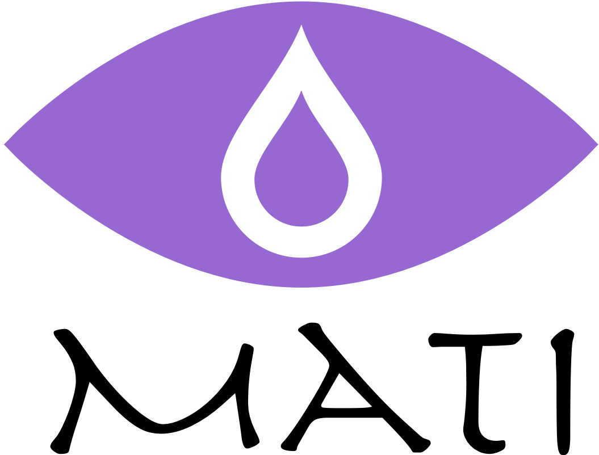
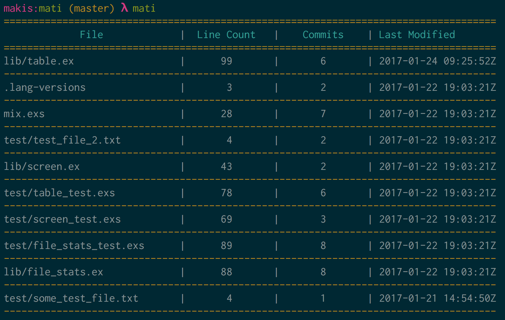

[](https://circleci.com/gh/Maikon/Mati)

A command line utility that provides quick overview of your project. The goal is to indicate key files of the project as well as files that may be prone to frequent change.



## Installation

The project assumes you have Elixir (__1.4.0__) and Erlang (__19__) installed. First clone the repository:

```
git clone git@github.com:Maikon/Mati.git
```

Then switch to the Mati directory and run the installation script:

```
cd Mati

sh install.sh
```

This will create an executable and add it to your path under `/usr/local/bin`

## Usage

The files as they appear on the table are sorted based on two things:

1. First the files are sorted by their churn. This is the relationship between the lines in a file and the number of commits that have changed that file
2. The above result then gets the sorted by the files that were modified most recently

Mati will use the defaults when it's run without any flags. The available flags are:

1. `--target` - target directory (defaults to ".")
2. `--ignore` - patterns to ignore (i.e png,jpg etc)
3. `--files`  - number of files to show (defaults to 10)
4. `--help`   - show example usage

Here's some examples using the flags:

```
# target the lib directory only
mati --target lib

# target the lib directory and ignore any png,jpg,txt files
mati --target lib --ignore png,jpg,txt

# target the lib directory and limit the output to 20 files
mati --target lib --files 20

# print all the files for the current directory
mati --files all

# print all the files for the test directory ignoring png and jpg
mati --target test --ignore png,jpg --files all
```

## Credit

I built this project to make working with legacy projects and identifying key files easier.

It is inspired by the work of [Adam Tornhill](https://twitter.com/AdamTornhill) on analysing codebases using forensic psychology. For more in depth tooling and insights I would recommend
watching [his talks](https://www.youtube.com/results?search_query=adam+tornhill) and checking out [his work](https://codescene.io).
